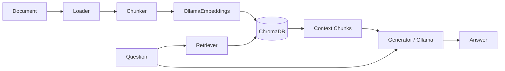

## Sovereign Document Agent

Local RAG system that ingests documents, stores them as vector embeddings, and answers questions using a local LLM.
All data stays on your machine — no API keys, no cloud calls, fully GDPR-compliant.

## Architecture



## Tech Stack

| Component | Technology |
|-----------|------------|
| LLM | Ollama (llama3, local) |
| Embeddings | Ollama Embeddings |
| Vector Store | ChromaDB (persistent) |
| Orchestration | LangChain |
| API | FastAPI + Uvicorn |
| PDF Parsing | pypdf |
| Containerization | Docker + docker-compose |
| CI/CD | GitHub Actions |

## Features

- Ingest PDF, TXT, and CSV documents into a persistent vector store
- Retrieve relevant chunks via similarity search against ChromaDB
- Generate answers grounded in retrieved context using a local Ollama model
- REST API with endpoints for ingestion, querying, document listing, and health checks
- Document registry that tracks which files have been indexed
- File validation with size, type, and existence checks before ingestion
- Benchmark script that measures per-query latency with P95 reporting
- Fully containerized — one command to start

## Quick Start

```bash
git clone https://github.com/Anas9-8/sovereign-document-agent.git
cd sovereign-document-agent
```

```bash
cp .env.example .env
# Edit .env if you want a different OLLAMA_MODEL
```

```bash
docker compose up
```

> Ollama must be running on the host with your chosen model pulled (`ollama pull llama3`).

## API Reference

| Method | Endpoint | Description |
|--------|----------|-------------|
| POST | `/ingest` | Ingest a document into the vector store |
| POST | `/query` | Query the RAG pipeline with a question |
| GET | `/documents` | List all indexed documents |
| GET | `/health` | Health check with indexed doc count and model name |

## Configuration

| Variable | Default | Description |
|----------|---------|-------------|
| `OLLAMA_MODEL` | `llama3` | Ollama model for LLM and embeddings |
| `OLLAMA_BASE_URL` | `http://localhost:11434` | Ollama server URL |
| `CHROMA_PATH` | `./data/chroma` | ChromaDB persistent storage path |
| `DOCS_PATH` | `./data/docs` | Directory to scan for documents |
| `REGISTRY_PATH` | `./data/registry.json` | JSON file tracking indexed documents |
| `CHUNK_SIZE` | `500` | Characters per text chunk |
| `CHUNK_OVERLAP` | `50` | Overlap between consecutive chunks |
| `TOP_K_RESULTS` | `3` | Number of chunks retrieved per query |
| `MAX_FILE_SIZE_MB` | `50` | Maximum allowed file size for ingestion |
| `API_PORT` | `8000` | FastAPI server port |
| `LOG_LEVEL` | `INFO` | Logging level (DEBUG, INFO, WARNING, ERROR) |

## Development

```bash
python3 -m venv venv
source venv/bin/activate
pip install -r requirements.txt
```

```bash
pytest tests/ -v
```

```bash
python scripts/benchmark.py
```

## Benchmark Results

See `benchmark_results.md` after running the benchmark script.

## License

MIT
