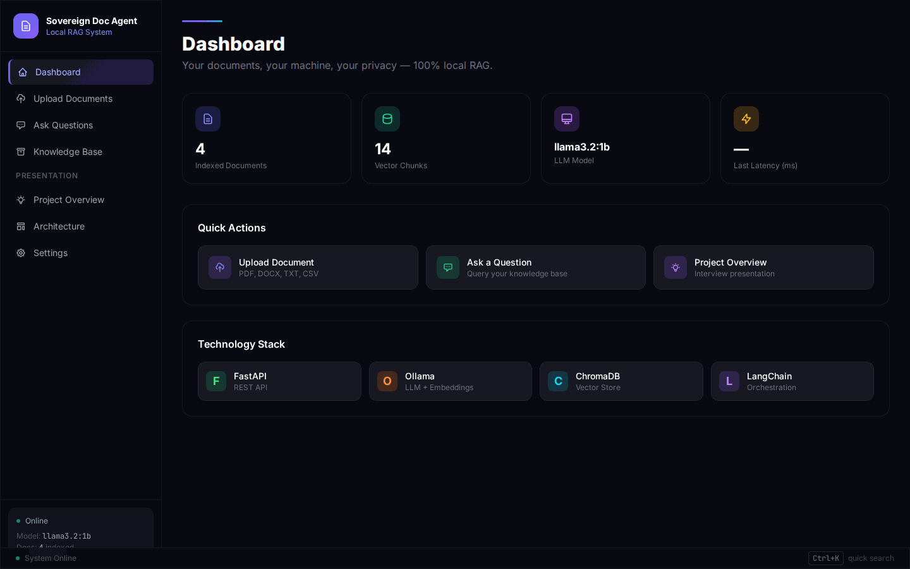
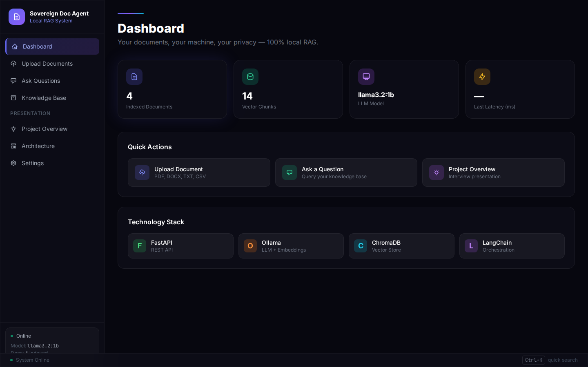
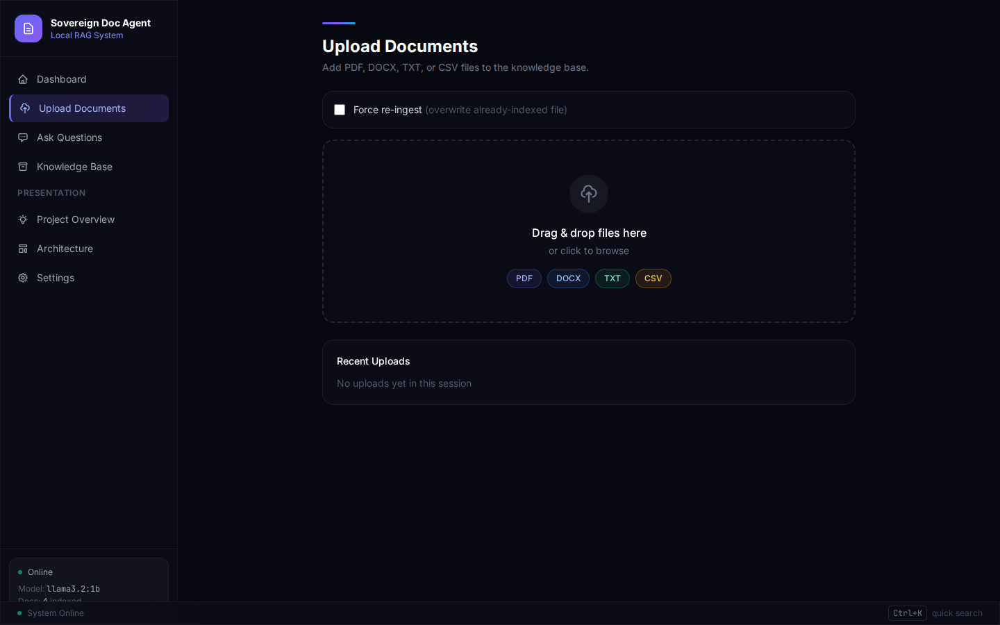
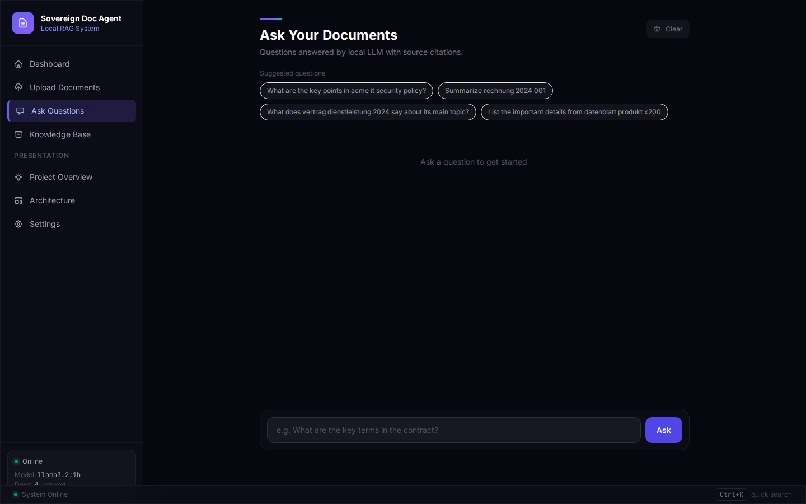
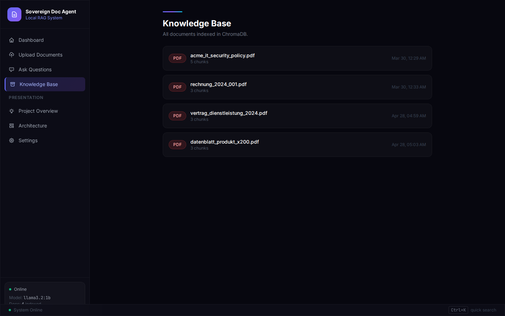
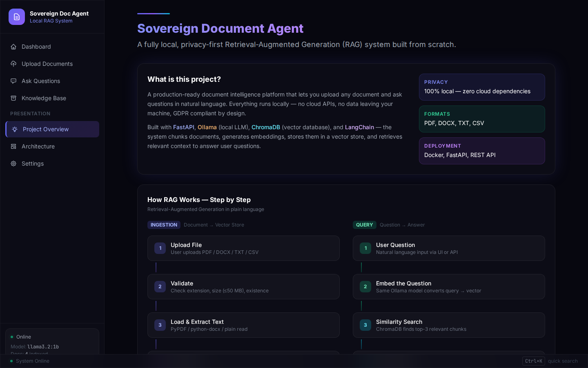
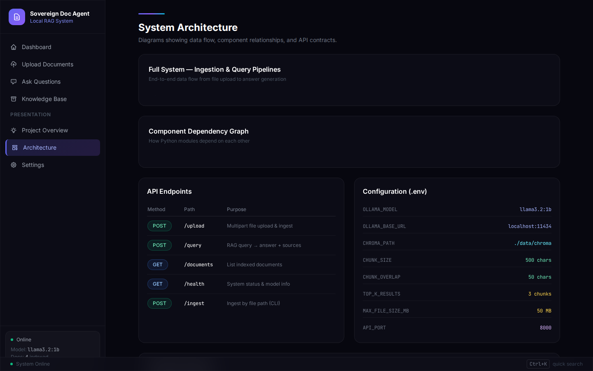
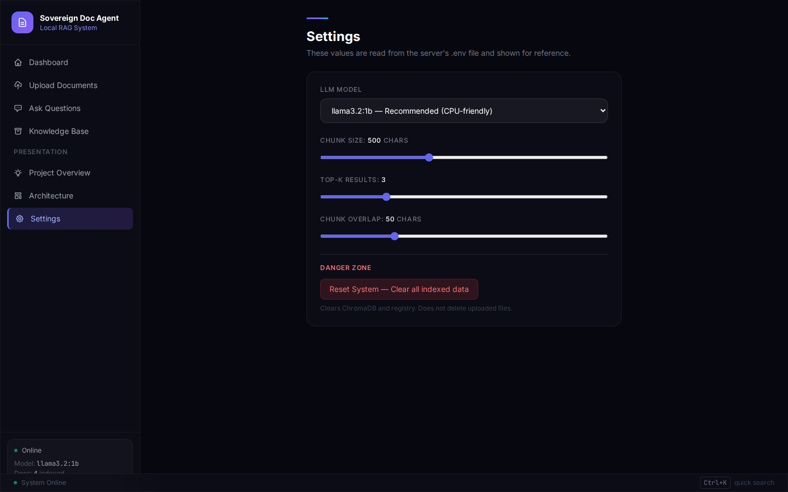
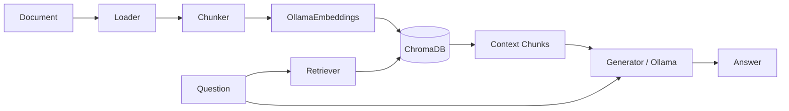

# Sovereign Document Agent

> **Local RAG system for intelligent document processing — no cloud, no API keys, 100% GDPR-compliant.**

Ingest documents in any format (PDF, DOCX, TXT, CSV), embed them into a local vector database, and query them through a local LLM that cites its sources. Everything runs on your machine. No data leaves your network.



---

## Quick Start

```bash
# 1. Clone
git clone https://github.com/Anas9-8/sovereign-document-agent.git
cd sovereign-document-agent

# 2. Pull the AI model (one time)
ollama pull llama3.2:1b

# 3. Start everything
make run
```

Open **http://localhost:8000** — the browser opens automatically.

---

## All Commands

```bash
make run     # Start the API server + open browser automatically
make demo    # Ingest sample documents, then start server
make test    # Run all 10 unit tests (no Ollama needed)
make ingest  # Ingest all documents in data/docs/
make clean   # Reset ChromaDB and document registry
make check   # Run linter (ruff)
make setup   # First-time install: create venv + install dependencies
```

No need to activate a virtual environment manually — `make` handles it.

---

## User Interface

The application ships with a full web interface — a single-page application with dark glassmorphism design, a persistent navigation sidebar, and seven functional sections. Every section connects to the backend through the REST API in real time.

---

### Dashboard



The main control center. Four live stat cards update on every page load:

| Card | What it shows |
|------|--------------|
| **Indexed Documents** | Total number of files successfully ingested into ChromaDB |
| **Vector Chunks** | Total text chunks stored across all documents — reflects the actual volume of searchable knowledge |
| **LLM Model** | The active Ollama model name (e.g. `llama3.2:1b`), pulled live from the `/health` endpoint |
| **Last Latency** | Response time of the most recent query in milliseconds — a direct performance indicator |

Below the stats:
- **Quick Actions** — three shortcut buttons that navigate directly to Upload, Ask Questions, and Project Overview
- **Technology Stack** — visual badges for every core component (FastAPI, Ollama, ChromaDB, LangChain), so anyone reviewing the project immediately sees the full stack

The **sidebar status panel** at the bottom left shows a pulsing green dot when Ollama is reachable, the model name, and the indexed document count — giving instant visibility into system health without clicking anything.

---

### Upload Documents



The ingestion interface. This is where documents enter the RAG pipeline:

- **Drag-and-drop zone** — drag files directly onto the dashed area, or click to open a system file browser. Color-coded badges show the four accepted formats: PDF (indigo), DOCX (blue), TXT (green), CSV (amber)
- **Force re-ingest checkbox** — by default the system detects already-indexed files and skips them. Enabling this toggle forces the pipeline to re-extract, re-chunk, and re-embed the file, replacing its previous vector representation
- **Upload progress bar** — an animated gradient bar tracks the upload and server-side processing for each file in real time
- **Recent uploads log** — a session history of every file processed, showing filename, chunk count, and final status (success / skipped / error)

Behind the scenes, each uploaded file passes through: validator (extension + size + existence check) -> loader (pypdf / python-docx / plain text) -> chunker (RecursiveCharacterTextSplitter) -> OllamaEmbeddings -> ChromaDB -> JSON registry.

---

### Ask Questions



A conversational chat interface for querying the knowledge base using natural language:

- **Suggested questions** — automatically generated from the names of indexed documents. Each chip is clickable and prefills the input field, so you can start querying immediately without knowing the content
- **Chat thread** — a scrollable conversation with styled message bubbles. User questions appear on the right, AI answers on the left
- **Source citations** — every answer includes the filename(s) the LLM used as context, so you can verify where the information came from
- **Latency indicator** — each response displays the total pipeline time in milliseconds (retrieval + generation)
- **Clear button** — resets the conversation history without affecting indexed documents

The pipeline behind each question: user query -> OllamaEmbeddings converts it to a vector -> ChromaDB similarity search finds the top-K most relevant chunks -> the chunks are assembled into a prompt -> Ollama LLM generates a grounded answer citing the source files.

---

### Knowledge Base



A registry of every document currently indexed in the system. Each entry shows:

- **Filename** with a color-coded format badge (PDF, DOCX, TXT, CSV)
- **Chunk count** — how many text chunks were extracted from that document
- **Ingestion timestamp** — the exact date and time the document was processed

This view maps directly to the `/documents` API endpoint and the `data/registry.json` file. It provides full traceability: you can see exactly which files the system has processed and when.

---

### Project Overview



An interactive presentation panel designed for technical demos and interviews. Contains:

- **What is this project?** — a concise summary of the system's purpose, with three highlight cards: Privacy (100% local), Formats (PDF, DOCX, TXT, CSV), and Deployment (Docker, FastAPI, REST API)
- **How RAG Works — Step by Step** — a visual two-column walkthrough showing the ingestion pipeline (left: Upload -> Validate -> Load -> Chunk -> Embed -> Store) and the query pipeline (right: Question -> Embed -> Search -> Retrieve -> Generate -> Answer) side by side
- **GDPR compliance rationale** — why local-only processing matters for sensitive data like medical records or contracts

This section exists so that someone reviewing the project — a hiring manager, a technical interviewer, or a colleague — can understand the full system in under two minutes without reading code.

---

### Architecture



A technical reference panel with four sections:

- **Full System — Ingestion & Query Pipelines** — Mermaid diagrams showing the end-to-end data flow from file upload to answer generation
- **Component Dependency Graph** — how the Python modules depend on each other
- **API Endpoints** — a complete table of every endpoint (POST `/upload`, POST `/query`, GET `/documents`, GET `/health`, POST `/ingest`) with method badges and descriptions
- **Configuration (.env)** — a live display of all environment variables and their current values (model name, ChromaDB path, chunk size, overlap, top-K, max file size, API port)

---

### Settings



A live configuration panel for adjusting system behavior without restarting the server:

- **LLM Model selector** — dropdown to choose the active Ollama model (defaulting to `llama3.2:1b — Recommended (CPU-friendly)`)
- **Chunk Size slider** — controls how many characters each text chunk contains (default: 500)
- **Top-K Results slider** — how many relevant chunks to retrieve per query (default: 3)
- **Chunk Overlap slider** — overlap between consecutive chunks to preserve context at boundaries (default: 50)
- **Danger Zone** — a reset button that clears all indexed data (ChromaDB + registry) without deleting the original uploaded files

---

## Architecture



**Two packages:**

- **`src/`** — core logic, no HTTP concerns
  - `ingestor.py` — load, chunk, embed, store (PDF / DOCX / TXT / CSV)
  - `retriever.py` — ChromaDB similarity search
  - `generator.py` — Ollama LLM calls with source-citing prompt
  - `pipeline.py` — retriever + generator end-to-end
  - `validator.py` — file checks (extension, size, existence)
  - `registry.py` — JSON registry tracking all indexed documents
  - `vectorstore.py` — singleton ChromaDB + OllamaEmbeddings instance
  - `logger.py` — stdout + file logging

- **`api/`** — FastAPI layer, no business logic
  - `main.py` — app setup, CORS, static UI, auto-opens browser
  - `routes.py` — 5 endpoints (see below)

---

## API Reference

| Method | Endpoint | Description |
|--------|----------|-------------|
| `GET` | `/` | Serves the web UI |
| `POST` | `/upload` | Upload a file directly from the browser (multipart) |
| `POST` | `/ingest` | Ingest a file by server-side path |
| `POST` | `/query` | Query the RAG pipeline with a question |
| `GET` | `/documents` | List all indexed documents with metadata |
| `GET` | `/health` | System status — model name and indexed doc count |

Interactive API docs (auto-generated by FastAPI): **http://localhost:8000/docs**

---

## Tech Stack

| Component | Technology |
|-----------|------------|
| LLM | Ollama (`llama3.2:1b`, runs locally) |
| Embeddings | Ollama Embeddings (same model) |
| Vector Store | ChromaDB (persistent on disk) |
| Orchestration | LangChain |
| API | FastAPI + Uvicorn |
| Document Parsing | pypdf, python-docx |
| UI | Vanilla JS + Tailwind CSS (single HTML file) |
| Containerization | Docker + docker-compose |
| CI/CD | GitHub Actions (lint + test + docker build) |

---

## GDPR Compliance

This system was designed from the ground up for environments that handle sensitive data:

- **No external API calls** — the LLM and embeddings run entirely via Ollama on `localhost`
- **No cloud storage** — ChromaDB persists to `./data/chroma` on your local disk
- **No telemetry** — no analytics, no third-party SDKs that phone home
- **Data stays on your machine** — suitable for processing confidential documents such as medical records, contracts, or personnel files

---

## Configuration

All settings via environment variables. Copy `.env.example` to `.env` to get started:

```bash
cp .env.example .env
```

| Variable | Default | Description |
|----------|---------|-------------|
| `OLLAMA_MODEL` | `llama3.2:1b` | Model used for LLM and embeddings |
| `OLLAMA_BASE_URL` | `http://localhost:11434` | Ollama server URL |
| `CHROMA_PATH` | `./data/chroma` | ChromaDB persistent storage path |
| `DOCS_PATH` | `./data/docs` | Folder scanned for documents |
| `REGISTRY_PATH` | `./data/registry.json` | JSON file tracking indexed documents |
| `CHUNK_SIZE` | `500` | Characters per text chunk |
| `CHUNK_OVERLAP` | `50` | Overlap between consecutive chunks |
| `TOP_K_RESULTS` | `3` | Chunks retrieved per query |
| `MAX_FILE_SIZE_MB` | `50` | Maximum file size allowed |
| `API_PORT` | `8000` | FastAPI port |
| `LOG_LEVEL` | `INFO` | Logging level |

---

## Docker

```bash
docker compose up
```

Ollama must be running on the host before starting the container:

```bash
ollama pull llama3.2:1b
ollama serve
```

---

## Testing

All tests mock external services (Ollama, ChromaDB). No running services needed:

```bash
make test
# or
pytest tests/ -v
```

10 tests across three files:

| File | Tests |
|------|-------|
| `test_api.py` | health endpoint, query endpoint, documents endpoint |
| `test_pipeline.py` | chunking, size limits, skip-if-already-indexed |
| `test_validator.py` | valid PDF, missing file, bad extension, empty file |

---

## Benchmark

```bash
PYTHONPATH=. python scripts/benchmark.py
```

Runs 10 representative queries and reports average and **P95 latency**. Falls back to synthetic results automatically if Ollama is offline. Results saved to `benchmark_results.md`.

---

## Troubleshooting

**Port 8000 already in use:**
```bash
uvicorn api.main:app --host 0.0.0.0 --port 8001
```

**ChromaDB dimension mismatch** (after changing `OLLAMA_MODEL`):
```bash
make clean
make ingest
```

**Ollama not found / connection refused:**
```bash
ollama serve       # start Ollama
ollama pull llama3.2:1b   # pull model if not downloaded
```

---

## License

MIT
